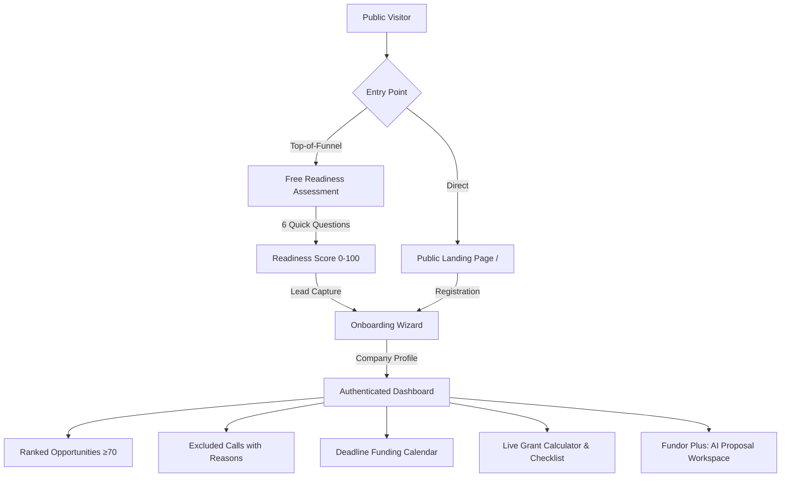

<div align="center">

# Fundor.hu

Frontend integration: [API setup and examples](docs/FRONTEND-API.md) · [OpenAPI contract](openapi.yaml)

### AI-Powered Grant & Funding Intelligence for Hungarian SMEs

> *"Ne te keresd a pályázatot. A Fundor megtalálja neked."*  
> *(Don't go looking for grants. Fundor finds them for you.)*

[](https://php.net)
[](https://laravel.com)
[](#-license--intellectual-property-protection)
[](#-bilingual-architecture-hu--en)
[](#-core-algorithms--scoring-engine)
[](#-design-system--color-tokens)

</div>

---

## Executive Summary

Hungarian small and medium-sized enterprises (SMEs) have access to substantial non-repayable EU and national grants (typically 5–50 million HUF per successful tender). However, most companies never apply due to three systemic market barriers:

1. **Volume Without Relevance:** Public portals list hundreds of complex tenders without personalized filtering.
2. **Impenetrable Eligibility Criteria:** Rules combine staff headcount bands, TEÁOR activity codes, regional NUTS-2 restrictions, closed financial years, project size floors, own-contribution minimums, and de minimis state aid ceilings.
3. **Invisible Deadlines:** Evaluation stages often exhaust budgetary envelopes weeks before formal closing dates.

**Fundor is not another passive grant list.** It is an automated, personalized decision-making layer that deterministically filters open calls against a structured company profile, synthesizes a 5-factor relevance score (0–100), and provides itemized legal justifications for every recommendation.

---

## Visual Architecture & Pipeline

```
  ┌─────────────────────────────────────────────────────────────┐
  │                 SME Company Funding Profile                 │
  │   (Headcount, TEÁOR Code, Region, Investment, De Minimis)   │
  └──────────────────────────────┬──────────────────────────────┘
                                 │
                                 ▼
  ┌─────────────────────────────────────────────────────────────┐
  │           Deterministic Eligibility Filter (Hard Rules)     │
  │     Operators: between | in | not_in | >= | <= | ==         │
  └──────────────────────────────┬──────────────────────────────┘
                                 │
         ┌───────────────────────┼───────────────────────┐
         ▼                       ▼                       ▼
   [NOT_ELIGIBLE]       [INSUFFICIENT_DATA]        [ELIGIBLE /
   Hard rule failed     Missing value queried      CONDITIONAL]
   (e.g. Pest excluded) (e.g. de minimis audit)         │
         │                       │                      │
         ▼                       ▼                      │
   Excluded from           Interactive Ask              │
   Score calculation       & Profile Update             │
                                 │                      │
                                 └──────────────────────┤
                                                        ▼
  ┌─────────────────────────────────────────────────────────────┐
  │             5-Factor Weighted Relevance Engine              │
  │     Score = 35% Eligibility + 25% ProjectFit +              │
  │             15% FundingSize + 15% Timing + 10% Feasibility  │
  └──────────────────────────────┬──────────────────────────────┘
                                 │
                                 ▼
  ┌─────────────────────────────────────────────────────────────┐
  │                    Fundor Intelligence UI                   │
  │   Ranked Opportunities • "Miért ajánljuk?" • Grant Calc     │
  └─────────────────────────────────────────────────────────────┘
```



---

## Design System & Color Tokens

The visual design language follows an authoritative modern grotesk editorial aesthetic, strictly verified against **WCAG AA contrast standards** (minimum 4.5:1 ratio for normal text and 3:1 for large graphical components):

| Token | Hex | Role & Application | Contrast Ratio |
|---|---|---|---|
| `--ink` | `#0E1726` | Deep navy background, dark hero cards, primary typography | 17.96:1 on white (AAA) |
| `--gold` | `#D99A2B` | Hunter Gold brand accent, primary CTA button surfaces, score rings | 7.36:1 with dark text (AA) |
| `--gold-deep` | `#8D5E06` | Accessible dark gold for text links and category tags | 5.62:1 on white (AA) |
| `--paper` | `#F5F7FA` | Subtle surface wash for dashboard containers and cards | Neutral base |
| `--green` | `#199268` | `ELIGIBLE` status badge, grant funding value displays | 5.71:1 on white (AA) |
| `--amber` | `#DD8331` | `CONDITIONAL` status badge, warning indicators | 5.02:1 on white (AA) |
| `--red` | `#CA4A4A` | `NOT_ELIGIBLE` status badge, explicit exclusion reasons | 4.88:1 on white (AA) |
| `--slate` | `#8A94A6` | `INSUFFICIENT_DATA` status badge, muted captions | 5.66:1 on white (AA) |

- **Display Typography:** `Space Grotesk` (tight tracking `-0.025em`, weights 600, 700) for numeric badges and display headlines.
- **Body Typography:** `Inter` (weights 400, 500, 600) for tabular data and legal descriptions.

---

## Core Algorithms & Scoring Engine

### 1. Deterministic Eligibility Engine
The core product rule: **the engine filters, the AI explains — the AI can never override a deterministic eligibility verdict.**

The rule engine assesses declarative criteria (`{field, operator, value}`) and emits one of four unambiguous verdicts:

| Verdict | Semantic Color | Meaning |
|---|---|---|
| `ELIGIBLE` | Green (`#199268`) | All hard criteria pass. Project size, region, TEÁOR code, and business history match. |
| `CONDITIONAL` | Amber (`#DD8331`) | Core criteria pass, but external conditions apply (e.g. de minimis certificate, co-financing proof). |
| `INSUFFICIENT_DATA` | Slate (`#8A94A6`) | Required information is unknown. The system questions the user rather than guessing. |
| `NOT_ELIGIBLE` | Red (`#CA4A4A`) | At least one hard gate fails. The call is immediately ruled out with specific legal grounds. |

### 2. Five-Factor Relevance Formula

$$\text{Fundor Score} = 0.35 \times \text{Eligibility} + 0.25 \times \text{ProjectFit} + 0.15 \times \text{FundingSize} + 0.15 \times \text{Timing} + 0.10 \times \text{Feasibility}$$

| Factor | Weight | Basis of Calculation |
|---|---|---|
| **Eligibility** | **35%** | Proportion of mandatory hard criteria fulfilled. |
| **ProjectFit** | **25%** | Semantic overlap between company development goals and call objectives. |
| **FundingSize** | **15%** | Proportion of planned budget absorbed within the call's funding floor and ceiling. |
| **Timing** | **15%** | Calendar days remaining until submission stage closure. |
| **Feasibility** | **10%** | Administrative complexity, required document count, and own-contribution ratio. |

**Score Bands:**
- **85–100:** Highly Recommended (Primary pursuit)
- **70–84:** Relevant Opportunity (Secondary pursuit, surfaced on dashboard by default)
- **50–69:** Conditional Opportunity (Requires specific prerequisite resolution)
- **0–49:** Low Relevance (Filtered out by default)

---

## Worked Comparison Demonstration

The landing page features a complete worked comparison using realistic Hungarian SME parameters:

- **Demo Profile:** Alfa Gyártó Kft. (28 employees, Pest county, TEÁOR 28 Machinery Manufacturing, 30M HUF investment).
- **Ranked Matches:**
  1. **Széchenyi Terv Plusz (Score: 95):** 10–100M HUF range, 50% intensity. *Fully eligible.*
  2. **GINOP Plusz (Score: 87):** 5–30M HUF range, 50% intensity. *Conditional: requires de minimis verification.*
  3. **DIMOP Plusz (Score: 87):** 8–25M HUF range, 60% intensity. *Conditional: requires IT audit.*
- **Excluded Calls (With Explicit Justification):**
  1. **TOP Plusz (Site Development):** *Excluded.* Pest county is excluded by territorial eligibility rules.
  2. **KAP (Agricultural Modernization):** *Excluded.* Non-agricultural primary code (TEÁOR 28 fails the 50% agro-revenue threshold).
  3. **EIC Accelerator (Deeptech):** *Excluded.* 30M HUF project falls below the 50M HUF minimum project floor.

---

## Bilingual Architecture (HU / EN)

Fundor provides bilingual capabilities with runtime locale switching and environment-aware defaults:

```
                  ┌─────────────────────────────────┐
                  │          HTTP Request           │
                  └────────────────┬────────────────┘
                                   │
                                   ▼
                  ┌─────────────────────────────────┐
                  │    App\Http\Middleware\SetLocale │
                  └────────────────┬────────────────┘
                                   │
          ┌────────────────────────┴────────────────────────┐
          ▼                                                 ▼
   [Local / Preview]                              [Production / Deployed]
   Default: English ('en')                        Default: Hungarian ('hu')
          │                                                 │
          └────────────────────────┬────────────────────────┘
                                   │
                                   ▼
                  ┌─────────────────────────────────┐
                  │     User Session Override?      │
                  │  (via language toggle /locale)  │
                  └────────────────┬────────────────┘
                                   │
                                   ▼
                  ┌─────────────────────────────────┐
                  │     app()->setLocale($lang)     │
                  │    Loads lang/en.json or hu     │
                  └─────────────────────────────────┘
```

- **Local Preview Mode:** Automatically defaults to **English (`en`)** on first visit.
- **Production Mode:** Automatically defaults to **Hungarian (`hu`)** when deployed (`APP_ENV=production`).
- **User Control:** Users can change languages via the header toggle (`Magyar` / `English`) at any point.
- **Translation Catalogs:** 370+ keys defined in `lang/en.json` and `lang/hu.json`.

---

## Directory Layout

```text
├── app/
│   ├── Http/
│   │   ├── Controllers/
│   │   │   ├── AdminController.php         # Administration and health metrics
│   │   │   ├── AssessmentController.php    # 6-question free readiness flow
│   │   │   ├── AuthController.php          # Session auth, registration, login
│   │   │   ├── CalendarController.php      # Monthly deadline schedule
│   │   │   ├── CrmController.php           # Lead management & CSV export
│   │   │   ├── DashboardController.php     # SME overview and match cards
│   │   │   ├── FavoriteController.php      # Bookmarked tenders
│   │   │   ├── HomeController.php          # Public landing page controller
│   │   │   ├── LocaleController.php        # Runtime language switching
│   │   │   ├── OnboardingController.php    # 5-step company profile builder
│   │   │   └── OpportunityController.php   # Catalog, scoring, grant calculator
│   │   └── Middleware/
│   │       └── SetLocale.php               # Environment-aware locale resolver
│   └── Models/
│       ├── CompanyProfile.php              # SME funding profile attributes
│       ├── Lead.php                        # Assessment leads
│       ├── Opportunity.php                 # Tenders with rules & scoring
│       └── User.php                        # User accounts & roles
├── config/
│   ├── app.php                             # General configuration & locale bindings
│   └── localization.php                    # Available locale mappings
├── database/
│   ├── migrations/                         # Database schema migrations
│   └── seeders/
│       └── DatabaseSeeder.php              # Curated Hungarian tenders seeder
├── lang/
│   ├── en.json                             # English translations catalog (370+ keys)
│   ├── hu.json                             # Hungarian translations catalog
│   └── hu/                                 # Hungarian validation & pagination
├── public/
│   ├── css/app.css                         # Fundor design token stylesheet
│   └── grassfeld.html                      # Standalone zero-dependency HTML build
├── resources/
│   └── views/
│       ├── home.blade.php                  # Fundor flagship landing page
│       ├── grassfeld.blade.php             # Dedicated grant & budgeting showcase
│       └── layouts/
│           ├── app.blade.php               # Authenticated application shell
│           └── guest.blade.php             # Public guest layout
└── tests/
    └── Feature/
        ├── ExampleTest.php                 # Home page HTTP 200 assertion
        ├── GrassfeldTest.php               # Showcase page HTTP 200 assertion
        └── LocalizationTest.php            # Bilingual translation tests
```

---

## Quick Start & Installation

### Prerequisites
- **PHP 8.2** or higher (with `pdo_sqlite`, `mbstring`, `openssl`, `tokenizer`, `xml` extensions)
- **Composer 2.x**
- **Node.js 18+** & **npm**

### Installation Steps

1. **Clone the repository:**
   ```bash
   git clone https://github.com/davidnagy-netizen/fundordothu.git
   cd fundordothu
   ```

2. **Install dependencies:**
   ```bash
   composer install
   npm install
   ```

3. **Configure environment:**
   ```bash
   cp .env.example .env
   php artisan key:generate
   ```

4. **Initialize database & seed curated Hungarian tenders:**
   ```bash
   php artisan migrate --seed
   ```

5. **Start local development server:**
   ```bash
   php artisan serve
   ```
   Open `http://127.0.0.1:8000` in your browser.

---

## Verification & Testing

Execute the automated test suite with PHPUnit:

```bash
# Run all feature and unit tests
php artisan test

# Test specific components
php artisan test --filter=ExampleTest
php artisan test --filter=GrassfeldTest
php artisan test --filter=LocalizationTest
```

---

## License & Intellectual Property Protection

This software, its source code, scoring algorithms, and user interface architecture are **PROPRIETARY AND CONFIDENTIAL** property of **Fundor.hu / Aetherpontis**. All rights reserved.

> **LEGAL NOTICE & STATUTORY WARNING:**  
> Strictly zero permission is granted to copy, clone, mirror, reproduce, modify, redistribute, sublicense, decompile, or reverse engineer this software, in whole or in part, without prior explicit written permission from the copyright holder.
>
> Any unauthorized copying, distribution, or replacement constitutes intentional copyright infringement under domestic and international intellectual property legislation (including EU Directive 2004/48/EC and WIPO conventions). Violators will be prosecuted to the maximum extent of the law, including civil claims for statutory and compensatory damages, injunctive relief, and criminal prosecution.

For complete terms and legal enforcement details, see the official **[LICENSE](LICENSE)** document.

For licensing permissions, enterprise agreements, or legal inquiries:
- Legal Department: `legal@fundor.hu` / `contact@aetherpontis.com`

---

## Disclaimers & Official Attributions

- **Data Sources:** Tenders and guidelines are processed from official government and European Union databases, including *palyazat.gov.hu* (Nemzeti Fejlesztési Központ), *kap.gov.hu* (Közös Agrárpolitika), *SEDIA* (EU Funding & Tenders Portal), and *Kohesio* (European Commission).
- **Regulatory Notice:** Fundor.hu is an algorithmic decision-support tool. It does not provide legal counsel or fiduciary financial advice. Award decisions rest exclusively with governing grant authorities.

<div align="center">
  <sub>Built with care for Hungarian SMEs by Aetherpontis.</sub>
</div>
